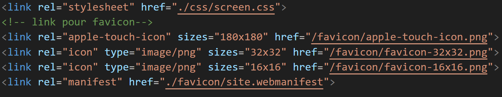

#**Refont web : développement** 🚀 

>Cette interface web à l’apparence très propre et bien designée, présente des erreurs de structuration. Les entêtes du document ne sont pas renseignées.
Par simple analyse écrite, minimum une page. Détaillez les points forts et faibles de cette page structurée en  HTML (_div vs semantique_) et css. Dans le validator W3C il y a 9 erreurs à corriger. Du coté css il faut appliquer l'unité de mesure REM :  n'oublié pas de déclarer la racine. Argumentez les erreurs que le développeur commet dans son approche techniques. Il y a également des erreurs d'accessiblité: veuillez m'en décrire quelques uns et m'expliquer la raison. A la fin de votre analyse réalisez la refonte de la page

> *Pour travailler plus confortablement procédez à un clône de ce dépôt git*.
> A la fin de votre réalisation créez un dépôt git avec l'affichage de la page d'index sur le navigateur.
> Trasmettez moi le lien sur mon spread-sheet que je vous est partagé. 
> L'exercice sera  noté /20

## LIEN du site: [home page](https://laetitiamichel.github.io/Refont-design-exo/)

## CHARTE GRAPHIQUE

# **HTML:**
Dans le HEAD, il manque :
    * les méta pour l'accessibilité des non-voyants
    * pour la compatibilité sur les différents supports
    * méta description pour le référencement naturel

    * <meta charset="UTF-8">
    * <meta http-equiv="X-UA-Compatible" content="ie=edge">
    * <meta name="viewport" content="width=device-width, initial-scale=1.0">
    * <meta name="description" content="web design and developpment">

### pour les link, il manque :
    * type="text/css" dans le link de la CSS
    * il n'y a pas de link FAVICON ni de manifest
    Je l'ai donc rajouté grâce au convertor favicon
    j'ai également converti le fichier Json du manifest et mis à jour les liens du Link
    * link rel="manifest" href="favicon/site.webmanifest"
    

## Dans le Body:

    * il n'y a pas de HEADER ni de MAIN pour structurer le HTML:
    j'ai donc rajouté un header dans le body afin d'y disposer le menu 
    `<body>
    <header>
        <nav class="navbar">
            

                <h2 class="logo">
                    Laetitia MICHEL
                </h2>
            
`

### ERREUR W3C:
    1. From line 13, column 17; to line 13, column 33 => le logo n'apparaît pas => un lecteur d'écran alertera l'utilisateur de la présence d'un titre, mais il ne lira aucun texte car il n'y en a pas. Cela peut perturber les utilisateurs et les empêcher d'accéder aux informations contenues dans la page.
        
 a été remplacé par un header puis une nav

    2. From line 27, column 17; to line 27, column 85 :
        * <input class="srch" type="search" name="" placeholder="Type To text">
        * il manque le name en "" 
        * j'ai rajouté : "barreRecherche"
        `

                <input class="srch" type="search" name="barreRecherche" placeholder="Type To text">
                <!--<a href="#"> -->
                <button class="btn">
                    Search
                </button>
                <!--</a>-->
            
`

    3. From line 28, column 30; to line 28, column 49 :
        *   href="#"> <button class="btn">Search
        * le button ne peut pas être dans une balise a

    4. From line 38, column 36; to line 38, column 47:
        *  la balise a ne peut pas être dans un bouton

    5. From line 43, column 21; to line 43, column 85:
        * input type="password" name="" placeholder="Enter Password Here"
        * le name n'est pas défini

    6. From line 44, column 42; to line 44, column 53
        * la balise a ne peut pas être dans un bouton

    7. From line 47, column 50; to line 47, column 53:
        * la balise p ne peut contenir la balise a mais l'inverse est possible

    8. From line 61, column 9; to line 61, column 14:
        * balise "v" ni fermée ni ouverte erreur de balise et sémantique
    9. From line 62, column 5; to line 62, column 10:
        * balise div mal fermée
